# 👩‍🔧 My Virtual Factory
## 🧐 Description
- Simulation of virtual factory management system 
- The system consists of a **central server** and **2 types of users**
- Users can communicate with the server continuously after the first connection
- Users use their own UI to do various operations
- Server app is a console app so it doesn't have a UI

## 👥 User Types
| #   | 🎨 Type  | 📝 Description                     | 🔢 Code |
| --- | ------- | --------------------------------- | ------ |
| 1   | Machine | Networked machines in the factory | `1`    |
| 2   | Planner | Managers of the factory           | `2`    |

## 💊 Operations
### 👩‍💼 Planners
- Login
- Listing connected machines with their details
- Getting machine details by ID
- Giving new order
- Listing waiting orders
- Logout

### 🤖 Machines
- Regestration
- Logout

### 💼 Server
- Planner authorization
- Machine regestration
- Regestering orders coming from planners
- Assigning new orders to alive machines
- Managing states of machines (busy/empty)
- Preventing double login of same planner 
- Managing sessions of planners and machines

## 📡 Connection Details
- The server listens for requests on port `1234`
- All requests must be made with **TCP** protocol

|          | Value  |
| -------- | ------ |
| Port     | `1234` |
| Protocol | TCP    |

## 🕵️‍♀️ Used Structures

### 📡 Communication and Management
- `InetAddress`
- `Socket`
- `Scanner`
- `PrintWriter`
- `Thread`
- `ServerSocket`

### 👀 Visual Components 
- `Container`
- `JTextField`
- `JComboBox`
- `JTextField`
- `JButton`
- `JButton`
- `JButton`
- `JLabel`
- `JLabel`
- `JFrame`
- `ActionListener`

## 📸 Screenshots
### 🤖 Machine

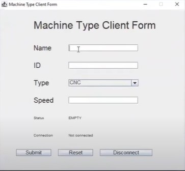
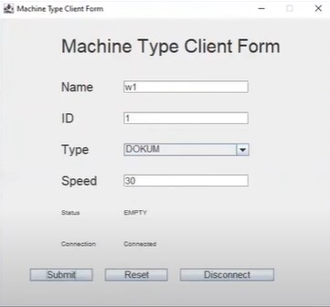
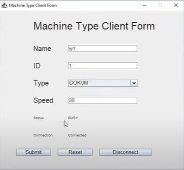

### 👩‍💼 Planner
#### 👮‍♀️ Login

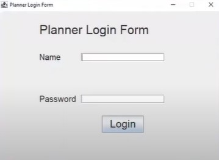
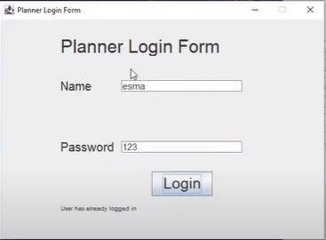

#### 📊 Dashboard
Listing machines:

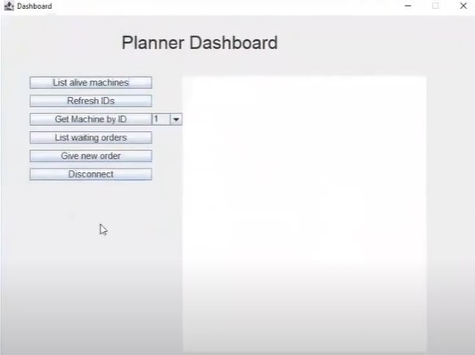
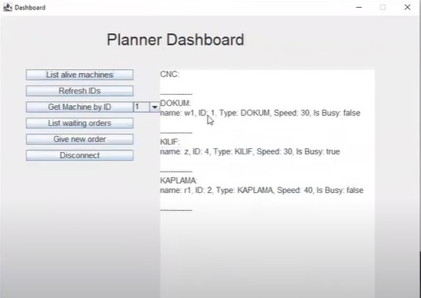
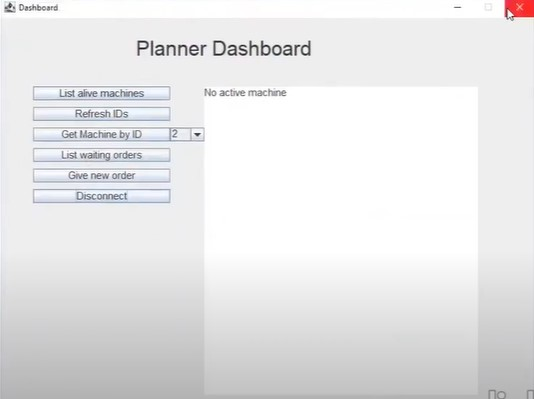

Get machine by ID:

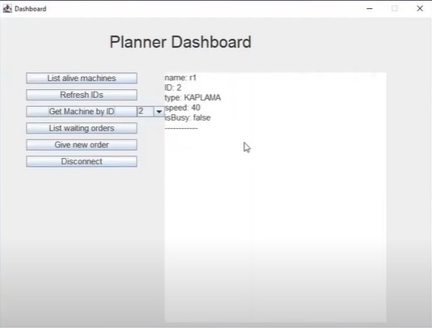

#### 📦 Orders

New  Order:

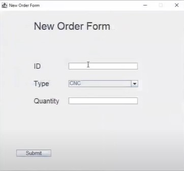

Listing orders:

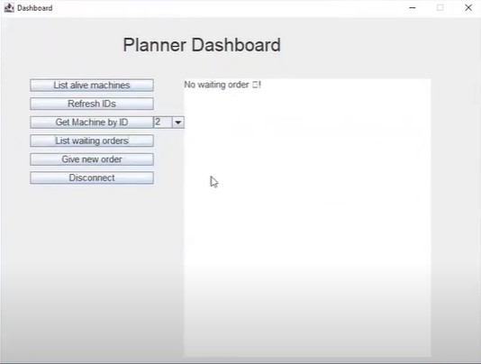

### 💼 Server

Log samples:

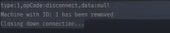
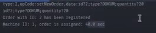
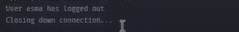

## 👮‍♀️ Protocol 
Detailed communication protcol is [📍 here](./doc/protocol.md)

## 👜 Contact
Find me on [LinkedIn](https://www.linkedin.com/in/asmaamirkhan/) and feel free to mail me, [Asmaa](mailto:asmaamirkhan.am@gmail.com) 🦋 and don't forget to take a look at [asmaamir.com 🥰](https://asmaamir.com/)
